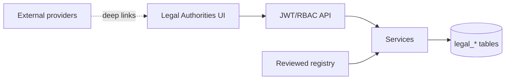
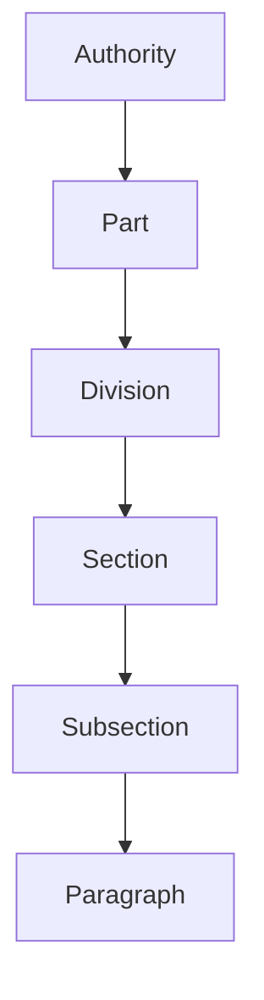

# Architecture
Malaysia-first React/Vite → authenticated Express API → service layer → additive SQLite `legal_*` tables. Official text, licensed content, internal notes and AI output remain separate. Phase LA-02 stores reviewed metadata and links only.

