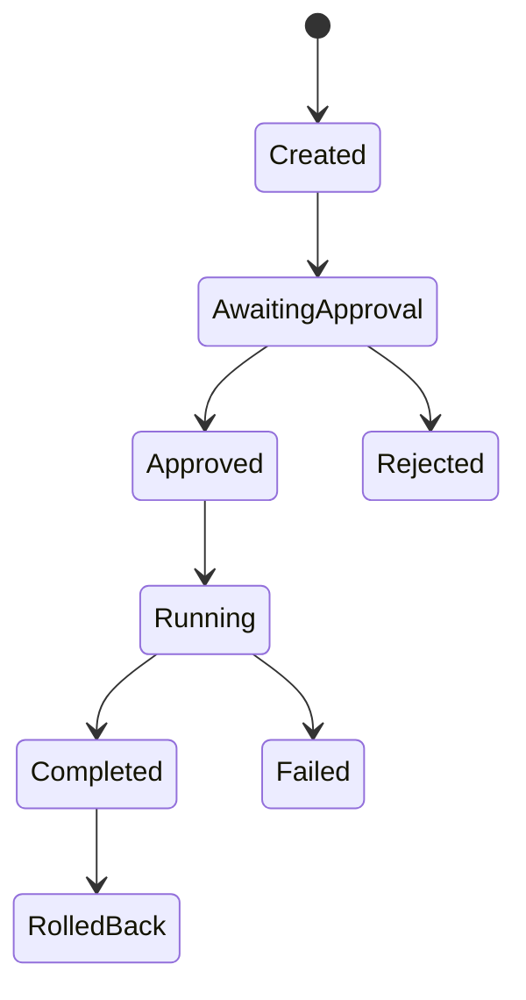

# Ingestion Pipeline
Future controlled flow: Discover → Acquire → Quarantine → Validate → Extract → Normalize → Deduplicate → Classify → Identify → Link → Index → Verify → Publish → Monitor. LA-02 performs no acquisition. Adapters require fixed allowlists, bounds, rate limits, licence approval, checksum, type/malware/privacy checks and human approval.

